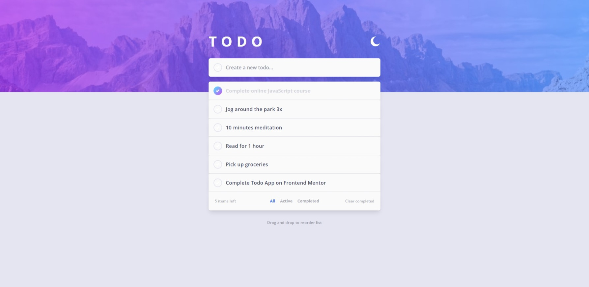

# Frontend Mentor - Swipable Todo App (Svelte/TailwindCss/localStorage)

This is a solution to the [Todo app challenge on Frontend Mentor](https://www.frontendmentor.io/challenges/todo-app-Su1_KokOW).

## Table of contents

- [Overview](#overview)
  - [The challenge](#the-challenge)
  - [Screenshot](#screenshot)
  - [Links](#links)
- [My process](#my-process)
  - [Built with](#built-with)
  - [What I learned](#what-i-learned)
  - [Continued development](#continued-development)
  - [Useful resources](#useful-resources)
- [Author](#author)

## Overview

### The challenge

Users should be able to:

- View the optimal layout for the app depending on their device's screen size
- See hover states for all interactive elements on the page
- Add new todos to the list
- Mark todos as complete
- Delete todos from the list
- Filter by all/active/complete todos
- Clear all completed todos
- Toggle light and dark mode
- **Bonus**: Drag and drop to reorder items on the list

### Screenshot




### Links

- Solution URL: [See solution here](https://www.frontendmentor.io/solutions/todo-app-localstorage-lightdark-mode-sveltekit-ts-and-tailwindcss-nL6zrqo54K)
- Live Site URL: [See live site here](https://todo-app-svelte-teal.vercel.app/)

## My process

### Built with

- Semantic HTML5 markup
- Flexbox
- LocalStorage - Save data as string on the browser
- [SvelteKit](https://kit.svelte.dev/) - JS framework
- [TailwindCss](https://tailwindcss.com/) - Utility-first CSS framework
- [Typescript](https://www.typescriptlang.org/) - Strongly typed JS
- [Swipablejs](https://github.com/SortableJS/Sortable) - JavaScript library for reorderable drag-and-drop lists.

### What I learned

#### LocalStorage

To use localStorage with Svelte you need to make sure to run your requests do not run on server since it is only avalaible on in the browser.

Svelte gives you an variable _browser_ to test the current context.

```js
import { browser } from "$app/env";
import type { LocalStorageKeys } from "../types";

export const getInitialData = ({ defaultValue, key }: { defaultValue: unknown, key: LocalStorageKeys }) => {
  // Test if you are running in the browser
  if (!browser) return defaultValue;
  const json = window.localStorage.getItem(key);
  return json === null ? defaultValue : JSON.parse(json);
};
```

#### CSS Gradient only on element border

<!-- prettier-ignore-start -->
```css
.border-gradient {
  background:
    linear-gradient(to top left,${theme("colors.white")},${theme("colors.white")}) padding-box
    linear-gradient(to top left,${theme("colors.purple")},${theme("colors.cyan")}) border-box;
    
  border-color: transparent;
}
```
<!-- prettier-ignore-end -->

#### @media(hover:hover)

Use this selector to apply css properties only when the user can hover (desktop).

#### Svelte animate:flip

Prevent jumps w/ smooth animation when a list gets updated (only in a #each block).

```js
  {#each filteredTodos as todo, index (todo.id)}
    <li
      draggable="true"
      out:slide|local={{ duration: 300 }}
      in:slide|local={{ duration: 300 }}
      animate:flip={{ duration: 300 }}
      class="cursor-move"
    >
      <TodoItem {todo} />
    </li>
  {/each}

```

### Continued development

[1] I plan to come back to this project to try and add an offline Db like pouchDb. Which means i would also implement authentication.

[2] I would like to find a way to prevent the screen from "flashing" because of the dark/light mode setup as the value is loaded from localStorage shortly after page load.

### Useful resources

- [Scale type & space without breakpoints](https://utopia.fyi/) - Helps you generate clean clamp() functions based on you needs.
- [Gradient Borders](https://codyhouse.co/nuggets/css-gradient-borders) - Good article on using gradient on borders.
- [Forms & Inputs labeling](https://www.w3.org/WAI/tutorials/forms/labels/) - How to provide labels to identify all form controls for accessibility.

## Author

- Frontend Mentor - [@AntoineC-dev](https://www.frontendmentor.io/profile/AntoineC-dev)
